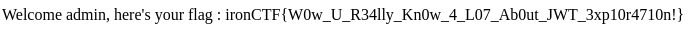

Summary:
1. This is a scavenger hunt challenge, there is a login page, creating an account signing in will not give you the flag. The goal is to create a JWT token to "fake" our username and change it to admin.
2. During login, we are given a cookie `secretkeypart2`, which means there are other parts.
3. Visit `/robots.txt`, this will give you `secretkeypart1` and a hint to and endpoint `Disallow: /secretkeypart4`
4. Visit `/sitemap.xml`, this will give you `secretkeypart3`
5. Visiting `/secretkeypart4` through a GET request will not get us anything and only return us 400 Bad Request error, however, using the HEAD method, we can get a response with the `secretkeypart4` in the headers.
6. Piece together all the parts to get the full secretkey, and use that to create a JWT token with `username: admin`, use that to login as admin and get the flag.

Secret key
1. `6yH$#v9Wq3e&Zf8L`
2. `pRt1%Y4nJ^aPk7Sd`
3. `2C@mQjUwEbGoIhNy`
4. `0T!BxlVz5uMKA#Yp`

Full: `6yH$#v9Wq3e&Zf8LpRt1%Y4nJ^aPk7Sd2C@mQjUwEbGoIhNy0T!BxlVz5uMKA#Yp`

!

Flag: `ironCTF{W0w_U_R34lly_Kn0w_4_L07_Ab0ut_JWT_3xp10r4710n!}`