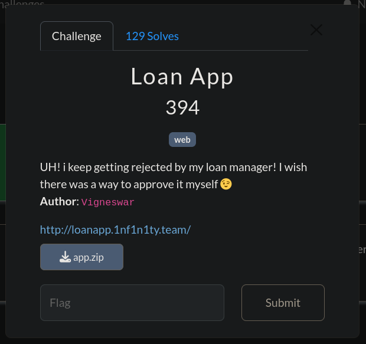
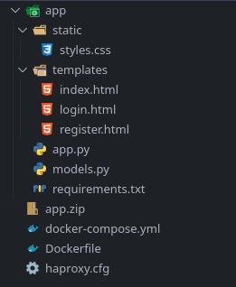
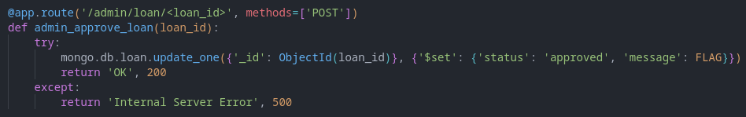

!

For this challenge, we are given the source code of the website.
!

Looking at the contents of app.py, we can see a couple of endpoins. We find an interesting function.
! This endpoint allows us to have our flag printed

Summary:
1. Create a valid UUIDv4 and use as username and password for registration then log in. In my case, I used python's `uuid.uuid4()` function to generate a valid uuid for me.
2. Create a loan request with any details.
3. Get the loan_id given to the user, and visit `/admin/loan/<loan_in>`, by using URL-encoding to bypass HAProxy restriction `/admin`, e.g. `/%61dmin/loan/<load_id>`, this will change the loan message to the flag.
4. Visit `/` once again to get the flag