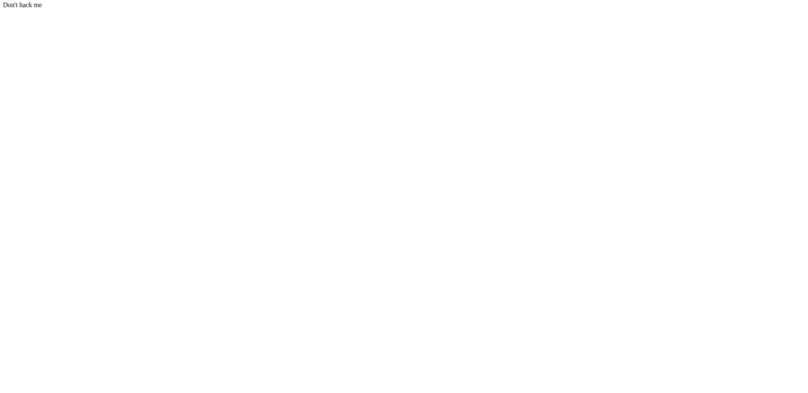
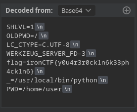

!

For this challenge, we are given the source code of the website. Inspecting the main source file, we have two functions.
!
!
Basically, this endpoint takes our input URL, validates the scheme and hostname through a blacklist, visits that URL if valid and converts to content to Base64 before returning it back to us.

Inspecting the source code, we also get another interesting endpoint.
!
!

Looking at the source code, this endpoint first checks if the request is coming from localhost, and  allows us to execute commands through the cmd request query parameter if it doesn't contain blacklisted substrings. However, the blacklist was not given in the source code.

In summary, the web application allows us to visit a URL and converts the content into base64. There is also an endpoint that allows us to potentially achieve remote code execution. 

Since the /admin endpoint only accepts requests from localhost, a viable solution here is to use the website's feature to visit the endpoint through port 5000.
!
!

But the problem is that the hostname, 127.0.0.1, is blacklisted. However, looking at the list of blacklisted hostnames, there is a hostname equivalent to localhost that is not blacklisted, and that is 127.000000000000000.1.
!
!

Converting this to base64, we get:
!

So our request went through. Now let's try to get the flag. 
!
Looking at the Dockerfile provided in the source code, we can see that the flag is stored in an environment variable. Let's try printing that out using the `env` command.
!
!

Converting this from base64, we get:
!

So our command did not go through, which means that `env` is in the list of blacklisted commands. However, we have a simple bypass for this, we can simply add backslashes in between our characters to bypass the check, `e\n\v`
!
!
!

`flag=ironCTF{y0u4r3r0ck1n6k33ph4ck1n6}`
And there's the flag!

In summary, this challenge combines SSRF and Command Injection as exploit. We use SSRF to access an internal service, and use Command Injection bypasses to execute any commands we want on the server.

